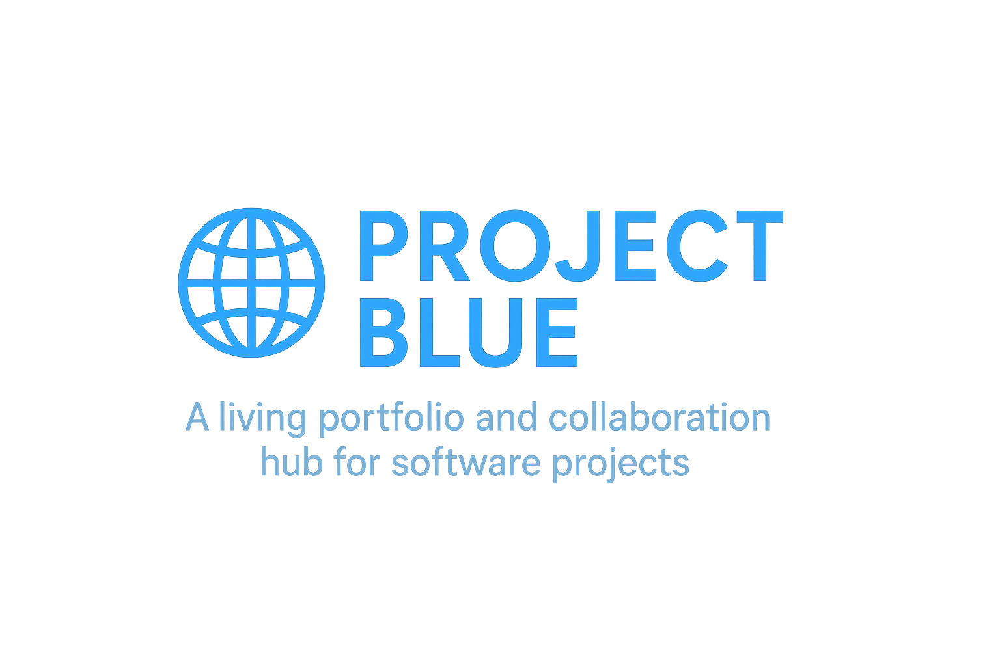

# Project Blue 🌐
*A living portfolio and collaboration hub for software projects.*  

**Author:** Xing Yu (Joe) Zhou  

## About Project Blue
Project Blue is a professional web platform designed to showcase my work as a software developer and provide a space for collaborators to feature their projects as well.  

The site will serve as:
- **A portfolio hub** – Employers can view my skills, experiences, and past projects in one place.  
- **A project showcase** – Live demos and write-ups highlight the technical work behind each application.  
- **A collaboration space** – Contributors can display their own work, demonstrating teamwork and shared innovation.  

## Vision
The goal of Project Blue is to combine professionalism with creativity:  
- Present my career, skills, and values in a clear and engaging format.  
- Offer interactive examples of software I’ve built, ranging from web apps to experimental tools.  
- Build a living platform that evolves as I grow as a developer.  

## Highlights
- 🌍 Centralized personal and collaborative portfolio.  
- 🔧 Deployed web applications demonstrating practical skills.  
- 👥 Contributor pages showcasing team members and joint projects.  
- 🚀 Continuous updates as new projects are completed.  

## Contributors
- **Xing Yu (Joe) Zhou** – Founder & Lead Developer  
- *(Additional contributors will be added as the project expands)*  

## Contact
- 📧 Email: [mr.joezhou@gmail.com](mailto:mr.joezhou@gmail.com)  
- 💼 LinkedIn: [linkedin.com/in/xing-yu-joe-zhou-27814124b](https://www.linkedin.com/in/xing-yu-joe-zhou-27814124b/)  
- 🐙 GitHub: [github.com/JoeZhou1234](https://github.com/JoeZhou1234)  

---

**Project Blue** is more than a portfolio—it’s a platform to create, collaborate, and showcase the journey of becoming a better developer.  
